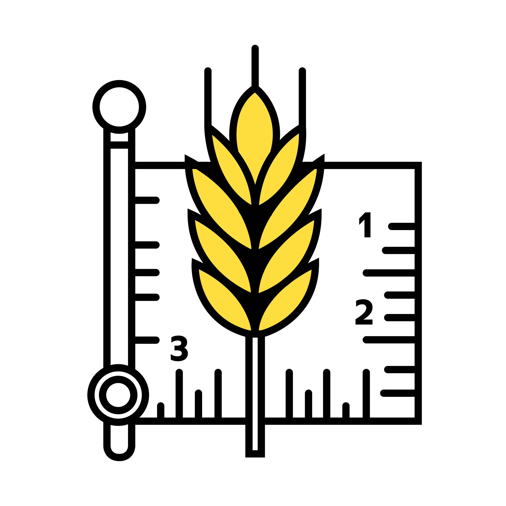
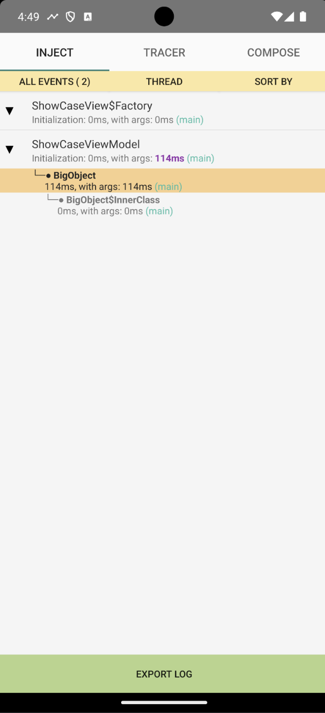
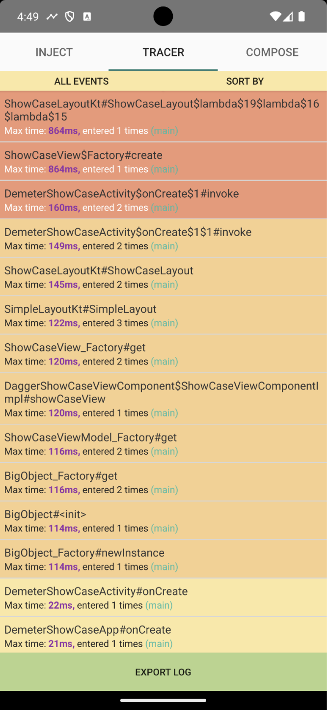
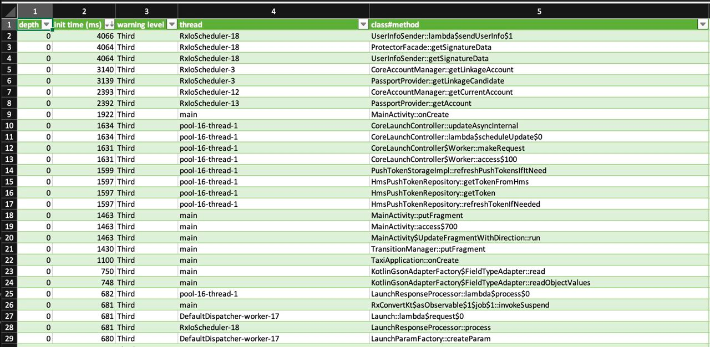
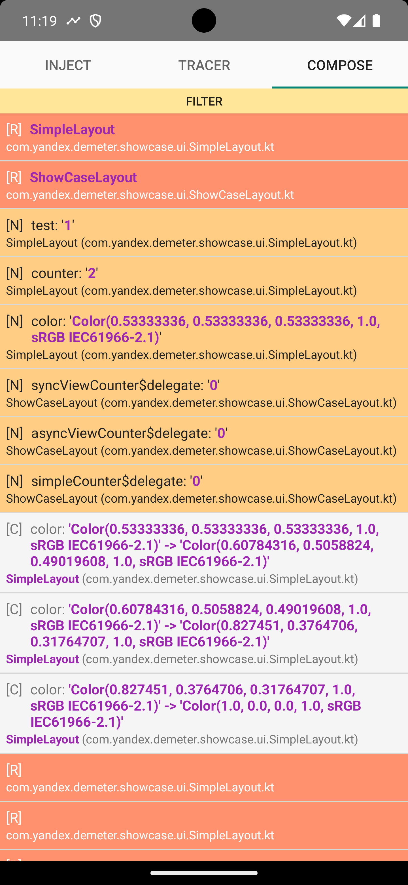
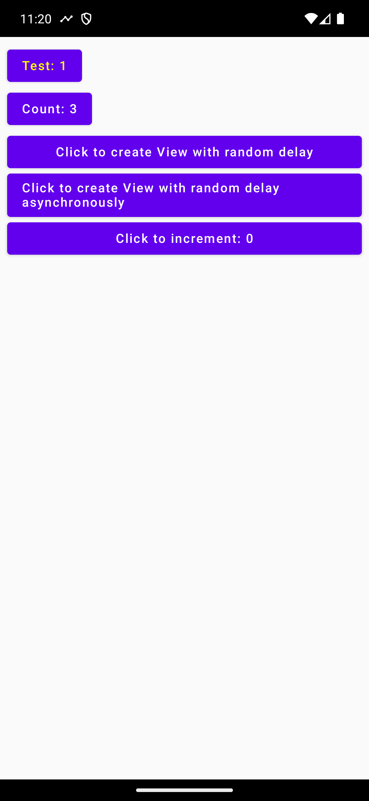

# Demeter




## Description

Demeter is a performance measurement library that can simplify performance issue investigation in your app. It's also useful to give a specially prepared build with Demeter inside to your QA team to use during regression testing and upload performance reports at the end.

## Features

- **Tracer**: Measures project methods with information about execution thread, execution time, and sorts by hazard level
- **Inject**: Wraps and measures `@Inject` constructor initializations and their dependencies. Useful for identifying problems with Dagger graphs
- **Compose**: Observes `StateObject` changes and recompositions
- Enriches methods with profileable sections that help investigate problems in Android Profiler or Profiler
- Exports measurements to CSV, Flamegraph, Firefox profiler and Flipper

## Screenshots



*Injected constructor analysis*



*Tracer for methods*



*Method export to Excel*

 

*Inspect Compose recompositions and StateObjects*

## Usage

Integrated Demeter provides an Activity that opens when you click the notification. The notification appears in any place of your application.

### Architecture

Demeter consists of the following libraries:

| Library | Description |
|---------|-------------|
| `demeter-core` | Base interfaces without implementations. Can be used for release build type |
| `demeter-profiler` | Main profiler implementation for dev/debug build types. **Do not attach to release builds!** |
| `demeter-profiler-base` | Base profiler logic |
| `demeter-profiler-ui` | Profiler UI components |
| `demeter-gradle-plugin` | Main Demeter Gradle Plugin |

### Profiler Plugins

Functionality is provided via profiler plugins:

| Plugin | Description |
|--------|-------------|
| `demeter-profiler-tracer-plugin` | Method tracing |
| `demeter-profiler-inject-plugin` | `@Inject` constructor analysis |
| `demeter-profiler-compose-plugin` | Jetpack Compose analyzer |

**Note**: When using published Maven artifacts (not building from source), you need to explicitly add plugin dependencies in addition to the main profiler dependency.

### Setup with UI

Use this setup to get the built-in metrics viewer accessible via notification.

**Step 1.** Add the Demeter plugin to your module's `build.gradle.kts`:
```kotlin
plugins {
    id("com.yandex.demeter")
}
```

**Step 2.** Add dependencies:
```kotlin
dependencies {
    debugImplementation("com.yandex.demeter:profiler:VERSION")

    // UI plugins (only add the ones you need):
    debugImplementation("com.yandex.demeter:profiler-tracer-ui-plugin:VERSION")
    debugImplementation("com.yandex.demeter:profiler-inject-ui-plugin:VERSION")
    debugImplementation("com.yandex.demeter:profiler-compose-ui-plugin:VERSION")
}
```

**Step 3.** Add profileable flag to your `AndroidManifest.xml` (inside `<application>` tag):
```xml
<profileable
    android:enabled="true"
    android:shell="true"
    tools:ignore="UnusedAttribute" />
```

**Step 4.** Initialize Demeter in your Application class:
```kotlin
override fun onCreate() {
    super.onCreate()

    Demeter.init(
        UiDemeterInitializer(
            context = this,
            uiPlugins = listOf(
                TracerUiDemeterPlugin(context = this),
                InjectUiDemeterPlugin(),
                ComposeUiDemeterPlugin(),
            ),
        )
    )
}
```

**Step 5.** Configure the Demeter Gradle plugin:
```kotlin
demeter {
    tracer {
        includedClasses = listOf("com.yandex.myapp")
    }
    inject {
        includedClasses = listOf("com.yandex.myapp")
    }
    compose()
}
```

**Step 6.** Build and run! A notification will appear to open the metrics viewer.

---

### Setup without UI

Use this setup when you want to collect metrics programmatically without the built-in UI. This is useful for custom reporting, analytics integration, or automated testing.

**Step 1.** Add the Demeter plugin to your module's `build.gradle.kts`:
```kotlin
plugins {
    id("com.yandex.demeter")
}
```

**Step 2.** Add dependencies:
```kotlin
dependencies {
    debugImplementation("com.yandex.demeter:profiler:VERSION")

    // Plain plugins (only add the ones you need):
    debugImplementation("com.yandex.demeter:profiler-tracer-plugin:VERSION")
    debugImplementation("com.yandex.demeter:profiler-inject-plugin:VERSION")
    debugImplementation("com.yandex.demeter:profiler-compose-plugin:VERSION")
}
```

**Step 3.** Add profileable flag to your `AndroidManifest.xml` (inside `<application>` tag):
```xml
<profileable
    android:enabled="true"
    android:shell="true"
    tools:ignore="UnusedAttribute" />
```

**Step 4.** Initialize Demeter in your Application class:
```kotlin
override fun onCreate() {
    super.onCreate()

    Demeter.init(
        DemeterInitializer(
            plugins = listOf(
                TracerDemeterPlugin(context = this),
                InjectDemeterPlugin(),
                ComposeDemeterPlugin(),
            ),
        )
    )
}
```

**Step 5.** Configure the Demeter Gradle plugin:
```kotlin
demeter {
    tracer {
        includedClasses = listOf("com.yandex.myapp")
    }
    inject {
        includedClasses = listOf("com.yandex.myapp")
    }
    compose()
}
```

**Step 6.** Build and run!

---

### Custom Reporter

You can provide a custom reporter to send metrics to your analytics or logging system:

```kotlin
val customReporter = DemeterReporter { payload ->
    // payload contains metrics data as Map<String, Any>
    analytics.track("demeter_metrics", payload)
}

// With UI
Demeter.init(
    UiDemeterInitializer(
        context = this,
        uiPlugins = listOf(
            TracerUiDemeterPlugin(context = this, reporter = customReporter),
            InjectUiDemeterPlugin(reporter = customReporter),
        ),
    )
)

// Without UI
Demeter.init(
    DemeterInitializer(
        plugins = listOf(
            TracerDemeterPlugin(context = this, reporter = customReporter),
            InjectDemeterPlugin(reporter = customReporter),
        ),
    )
)
```

---

### Gradle Plugin Configuration

Full configuration options:

```kotlin
demeter {
    tracer {
        enabled = true                                    // default: false
        debug = false                                     // default: false - enables ASM debug output
        includedClasses = listOf("com.yandex.myapp")      // required: packages to analyze
        excludedClasses = listOf("com.yandex.myapp.test") // optional: packages to exclude
    }

    inject {
        enabled = true                                    // default: false
        debug = false                                     // default: false - enables ASM debug output
        includedClasses = listOf("com.yandex.myapp")      // required: packages to analyze
        excludedClasses = listOf("com.yandex.myapp.di")   // optional: packages to exclude
    }

    compose {
        enabled = true  // default: false
        debug = false   // default: false - enables compiler plugin debug output
    }
}
```

You can also configure per build type separately:
```kotlin
android {
    buildTypes {
        getByName("debug") {
            demeter {
                tracer {
                    includedClasses = listOf("com.yandex.myapp")
                }
                inject {
                    includedClasses = listOf("com.yandex.myapp")
                }
                compose()
            }
        }
    }
}
```

## Configuration Reference

### Tracer Plugin Parameters

| Parameter | Type | Default | Description |
|-----------|------|---------|-------------|
| `enabled` | `Boolean` | `false` | Enable/disable tracer feature |
| `debug` | `Boolean` | `false` | Enable ASM debug output (TraceClassVisitor with ASMifier) |
| `includedClasses` | `List<String>` | `[]` | Class name prefixes to trace (**required** - if empty, nothing is traced) |
| `excludedClasses` | `List<String>` | `[]` | Class name prefixes to exclude from tracing |

**Note**: The following packages are always excluded from tracing:
- `java.*`, `javax.*`, `kotlin.*`, `kotlinx.*`
- `com.yandex.demeter.*` (except `com.yandex.demeter.showcase.*`)
- Kotlin intrinsics classes (ending with `WhenMappings`)

### Inject Plugin Parameters

| Parameter | Type | Default | Description |
|-----------|------|---------|-------------|
| `enabled` | `Boolean` | `false` | Enable/disable inject analysis |
| `debug` | `Boolean` | `false` | Enable ASM debug output |
| `includedClasses` | `List<String>` | `[]` | Class name prefixes to analyze (**required**) |
| `excludedClasses` | `List<String>` | `[]` | Class name prefixes to exclude |

### Compose Plugin Parameters

| Parameter | Type | Default | Description |
|-----------|------|---------|-------------|
| `enabled` | `Boolean` | `false` | Enable/disable Compose inspection |
| `debug` | `Boolean` | `false` | Enable compiler plugin debug output |

### Runtime Plugin Classes

| Plugin Class | Parameters | Description |
|--------------|------------|-------------|
| `TracerDemeterPlugin` | `context: Context`, `reporter: DemeterReporter?` | Plain tracer plugin |
| `InjectDemeterPlugin` | `reporter: DemeterReporter?` | Plain inject plugin |
| `ComposeDemeterPlugin` | none | Plain compose plugin |
| `TracerUiDemeterPlugin` | `context: Context`, `reporter: DemeterReporter?` | Tracer with UI |
| `InjectUiDemeterPlugin` | `reporter: DemeterReporter?` | Inject with UI |
| `ComposeUiDemeterPlugin` | none | Compose with UI |

## Gradle Plugins

Demeter feature plugins can be applied via the main plugin:
```kotlin
plugins {
    id("com.yandex.demeter")
}
```

Or applied directly:
```kotlin
plugins {
    id("com.yandex.demeter.tracer")
    id("com.yandex.demeter.inject")
    id("com.yandex.demeter.compose")
}
```

**Note**: The main plugin only applies sub-plugins that you specify in the `demeter` block.

### Available Gradle Plugins

| Plugin ID | Artifact | Description |
|-----------|----------|-------------|
| `com.yandex.demeter` | `demeter-gradle-plugin` | Main plugin (applies all sub-plugins) |
| `com.yandex.demeter.tracer` | `tracer-gradle-plugin` | Method tracing instrumentation |
| `com.yandex.demeter.inject` | `inject-gradle-plugin` | `@Inject` constructor instrumentation |
| `com.yandex.demeter.compose` | `compose-gradle-plugin` | Jetpack Compose compiler plugin |

## Flipper Integration

Demeter supports integration with Facebook's Flipper debugging tool:

```kotlin
dependencies {
    debugImplementation("com.yandex.demeter:flipper:VERSION")
}
```

Initialize with Flipper plugin:
```kotlin
// In your Flipper setup
val client = AndroidFlipperClient.getInstance(this)
client.addPlugin(DemeterFlipperTracerPlugin())
client.start()
```

## Troubleshooting

### Problem: `Built-in class kotlin.Any is not found`

**Crash stacktrace:**
```
java.lang.AssertionError: Built-in class kotlin.Any is not found
```

**Solution:** Ensure you don't exclude `.kotlin_builtins` files from the build:
```kotlin
android {
    packagingOptions {
        resources {
            // Remove or modify these excludes if present:
            // excludes += ['**/kotlin/**', '**.kotlin_builtins']
        }
    }
}
```

### Problem: No methods are being traced

**Possible causes:**
1. `includedClasses` is empty - you must specify at least one package prefix
2. The package name doesn't match your actual class packages
3. The plugin is not enabled (`enabled = false`)

**Solution:**
```kotlin
demeter {
    tracer {
        enabled = true
        includedClasses = listOf("com.your.package")  // Must match your actual package
    }
}
```

### Problem: Demeter UI notification doesn't appear

**Possible causes:**
1. Using `DemeterInitializer` instead of `UiDemeterInitializer`
2. Notification permissions not granted (Android 13+)

**Solution:** Use `UiDemeterInitializer` with UI plugins:
```kotlin
Demeter.init(
    UiDemeterInitializer(
        context = this,
        uiPlugins = listOf(TracerUiDemeterPlugin(this))
    )
)
```

## License

Apache License 2.0
